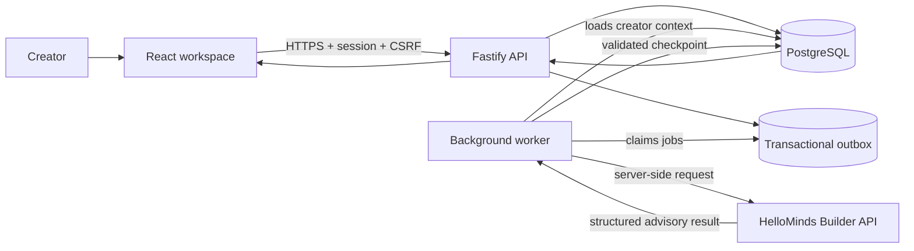

# Fanloom

<p align="center">
  
</p>

<p align="center">A persistent growth workspace for independent creators.</p>

<p align="center">
  <a href="https://fanloom-creative-minds.vercel.app">Live application</a> ·
  <a href="https://hellominds.ai/profile/minds/e9a6513e-f36b-1410-8466-00039ce7df11">Fanloom Mind</a> ·
  <a href="https://github.com/maixuancanh/fanloom/releases/download/creative-minds-submission/fanloom-creative-minds-demo.mp4">Demo video</a>
</p>

Fanloom helps creators keep their audience strategy moving without handing control to an opaque automation system. It remembers a creator's positioning, audience, channels, goals, and previous decisions; turns consented engagement evidence into practical growth recommendations; and follows up when a checkpoint becomes due.

The Mind is deliberately advisory. It can research and draft partner leads, outreach, and social plans, but it cannot send messages, approve campaigns, reward users, or move money. Every recommendation remains reviewable by the creator.

## What Fanloom does

- Maintains a durable Creator Brief across sessions.
- Produces partner-lead ideas, outreach drafts, and social plans from consented context.
- Continues work through a stable creator-scoped Mind conversation.
- Stores immutable recommendation checkpoints with evidence and profile snapshots.
- Runs idempotent follow-ups after rechecking ownership and active consent.
- Separates advisory output from creator-approved campaign execution.
- Provides dedicated views for overview, campaigns, audience, activity, and settings.

## How it works



The API owns authentication, creator boundaries, consent checks, and persistence. The worker is the only component allowed to call HelloMinds. Responses are accepted only when they match the configured Mind identity, reference known evidence, and conform to Fanloom's advisory-only contract.

For a deeper look at the boundaries and follow-up flow, see [docs/ARCHITECTURE.md](docs/ARCHITECTURE.md).

## Repository structure

```text
apps/
  api/          Fastify HTTP API and authenticated dashboard routes
  web/          React and Vite creator workspace
  worker/       Outbox processing and autonomous follow-up scheduler
packages/
  config/       Shared runtime configuration
  connectors/   Explicit action and payment adapter boundaries
  db/           Prisma client, schema, and migrations
  domain/       Consent, campaign, event, budget, and money rules
  minds/        HelloMinds client and response validation
  storage/      Artifact storage abstraction
infra/          Production-style Docker Compose stack
docs/           Architecture and operational runbooks
```

## Prerequisites

- Node.js 22 or newer
- npm 10 or newer
- PostgreSQL 16+
- Docker with Compose, if you want to run the full stack in containers
- A HelloMinds Mind and Builder API key for live advisory requests

## Environment configuration

Copy the example file before starting:

```bash
cp .env.example .env
```

On PowerShell:

```powershell
Copy-Item .env.example .env
```

Important variables:

| Variable | Used by | Purpose |
| --- | --- | --- |
| `FANLOOM_DATABASE_URL` | API, worker, Prisma | PostgreSQL connection string |
| `FANLOOM_SESSION_SECRET` | API | Signs sessions and CSRF tokens |
| `FANLOOM_ALLOWED_ORIGIN` | API | Allowed browser origin |
| `FANLOOM_LOCAL_DEMO` | API | Enables the seeded local creator login |
| `FANLOOM_MIND_ID` | Worker | Pins responses to one HelloMinds Mind |
| `MINDS_BUILDER_API_KEY` | Worker | Server-side Builder API credential |
| `MINDS_API_URL` | Worker | Optional Builder API endpoint override |
| `VITE_FANLOOM_API_URL` | Web build | Public URL of the Fanloom API |

Never expose `MINDS_BUILDER_API_KEY` in the browser or commit a populated `.env` file.

## Installation

Install the workspace from the lockfile:

```bash
npm ci
npm run db:generate --workspace @fanloom/db
```

Apply database migrations after `FANLOOM_DATABASE_URL` is available in your shell:

```bash
npm run db:deploy --workspace @fanloom/db
```

## Run with Docker Compose

The simplest way to run the complete application is the production-style Compose stack:

```bash
docker compose --env-file .env -f infra/compose.prod.yml up --build
```

The default endpoints are:

- Web: `http://localhost:4174`
- API: `http://localhost:3001`
- Health check: `http://localhost:3001/health`

Stop the stack with:

```bash
docker compose --env-file .env -f infra/compose.prod.yml down
```

Add `-v` only when you intentionally want to remove the local PostgreSQL volume.

## Run services during development

After exporting the variables from `.env` into your shell, start each service in its own terminal.

API:

```bash
npm run build --workspace @fanloom/api
node dist/apps/api/src/server.js
```

Worker:

```bash
npm run build --workspace @fanloom/worker
node apps/worker/dist/apps/worker/src/main.js
```

Web:

```bash
npm exec --workspace @fanloom/web -- vite --host 0.0.0.0 --port 4173
```

Set `VITE_FANLOOM_API_URL=http://localhost:3001` when the API is not available at the frontend host on port 3001.

## Using Fanloom

1. Open the application and select **Open your workspace**.
2. Complete the Creator Brief with your niche, audience, priority channels, 30-day goal, and differentiator.
3. Review the available engagement evidence and request a growth recommendation.
4. Inspect the returned checkpoint, including its evidence IDs, Mind identity, conversation alias, and follow-up date.
5. Review autonomous child checkpoints when a follow-up becomes due.
6. Use the Campaigns, Audience, Activity, and Settings views to manage the rest of the workspace.

The public application uses a fictional creator profile so the full workflow can be explored safely. It does not claim real follower growth or partner conversions.

## Tests and quality checks

```bash
npm test
npm run build
npm run typecheck
npm run lint
git diff --check
```

The tests cover authentication, CSRF, creator and tenant isolation, consent revocation, evidence validation, Mind identity pinning, malformed responses, idempotent outbox processing, autonomous continuity, campaign approval boundaries, connectors, and UI mapping.

## Deployment

The current public deployment uses:

- Vercel for the web application
- Railway for the API, worker, and PostgreSQL
- HelloMinds Builder API for Mind conversations

The three Dockerfiles at the repository root build the services independently. Keep the API and worker on the same database, configure the same `FANLOOM_MIND_ID`, and restrict `FANLOOM_ALLOWED_ORIGIN` to the deployed frontend URL.

## Security and authority boundaries

- Builder credentials are read only by server-side code.
- Mind responses must match the configured Mind ID.
- Evidence must belong to the active creator and tenant.
- Personalization consent is checked again when a follow-up runs.
- Outbox jobs use idempotency and claim tokens to avoid duplicate work.
- Mind recommendations cannot send, spend, reward, approve, or execute actions.
- Campaign execution remains an explicit creator-controlled workflow.

## License

Fanloom is available under the [MIT License](LICENSE). Third-party attribution is listed in [THIRD_PARTY_NOTICES.md](THIRD_PARTY_NOTICES.md).
